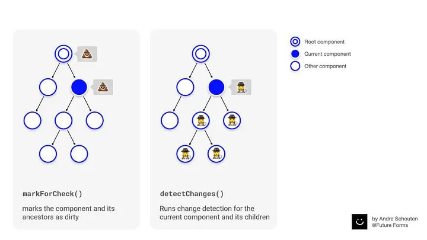

## Компоненты, директивы, пайпы
Что такое, в чем отличие
### Что такое Pipe

что такое, зачем использовать, отличие pure и impure нужен для преобразования данных прямо в HTML-шаблоне. Лучше использовать вместо функций. Пьюр Пайп выполняется только при изменении входных аргументов. А impure выполняется при changeDetection

## Dependency injection
Что такое, как используется, как внедрить зависимость

### @Injectable({
	provideIn: 'root' | 'platform' | null | [Type]
})
Для чего используется, что такое provideIn
root - на уровне корневого компонента
platform - на уровне main.ts - platformBrowserDynamic().bootstrapModule(AppModule)

### Providers
Как запровайдить заивимость, отличии useClass, useValue, useExist, useFactory
```typescript
...
providers: [
	ClassName,
	{
		provide: ClassName,
		useClass: ClassName
	},
	{
		provide: ServiceName,
		useExist: ServiceName, // использовать уже сущ. заивимость по токену ServiceName
	},
	{
		provide: TokenName,
		useValue: 222
	},
	{
		provide: TokenName,
		useFactory: (serv1, serv2) => new Service(),
		deps: [serv1, serv2],
		multi: true //использовать несколько зависимостей по одному токену
	}
]
...
```

### @Host, @Self, @SkipSelf, @Optional
Что такое, в чем разница

@Host - ищем завимисоть у себя и родителя
@Self - ищем зависимость у себя
@SkipSelf - Ищем у всех, кроме себя
@Optional - если есть - то берем зависиомсть, если нет - ошибку не выбрасываем

### ChangeDetection
Что такое, какие стратегии обнаружения изменений существуют

способ обнаружения изменений в angular приложении.

**ChangeDetectionStrategy.Default**  
  
По умолчанию Angular использует стратегию обнаружения изменений ChangeDetectionStrategy.Default. Эта стратегия проверяет каждый компонент в дереве компонентов сверху вниз каждый раз когда запускается обнаружение изменений,  
  
например:  
  
Browser events like click, mouseover, etc.  
  
asynchronous APIs:  
  
Promise.then()  
  
requestAnimationFrame()  
  
 AJAX calls  
  
Timers like setTimeout() or setInterval()  
  
Этот консервативный способ проверки без каких-либо доп. проверок зависимостей компонента называется грязной проверкой. Он может пагубно повлиять на производительность в больших приложениях которые содержат множество компонентов.


**Когда я начал активно использовать стратегию OnPush в компонентах моего приложения Angular, я понял, что обнаружение изменений запускается, когда**

- новая ссылка передается как значение @Input
- срабатывает обработчик событий, например (щелчок) 
- или срабатывает наблюдаемый объект при использовании asyncPipe в шаблоне.

Это правда, но компонент также помечен как грязный.
И это важная часть здесь.

Так что это не означает, что во всех остальных случаях обнаружение изменений не выполняется. Компонент может просто не быть помечен как грязный, поэтому он и его дочерние элементы не проверяются во время процесса обнаружения изменений.

Например, процесс также запускается, когда мы вызываем setTimeout(), setInterval(), Promise.then(), requestAnimationFrame() или другие асинхронные API. И это работает только потому, что Angular использует библиотеку zone.js.

### Lifecycle
Жизненнный цикл ангуляр компонента
constructor - создание экземпляра класса
ngOnChanges - срабатывает сразу после constructor и изменении @Input()
ngOnInit - вызывается один раз после первого ngOnChanges
ngDoCheck() - Вызывается сразу после `ngOnChanges()` при каждом запуске обнаружения изменений, и сразу после `ngOnInit()` при первом запуске.
ngAfterContentInit() - Вызывается _один раз_ после первой `ngDoCheck()`.
ngAfterContentChecked() - Вызывается после `ngAfterContentInit()` и каждой последующей `ngDoCheck()`.
ngAfterViewInit() - Реагирует после того, как Angular инициализирует представления и дочерние представления компонента или представление, содержащее директиву. Вызывается _один раз_ после первого `ngAfterContentChecked()`.
ngAfterViewChecked() - Вызывается после `ngAfterViewInit()` и каждого последующего `ngAfterContentChecked()`.
ngOnDestroy() - Вызывается непосредственно перед тем, как Angular уничтожит директиву или компонент.
# Роутинг Ангуляра

Попросить рассказать про роутинг, для чего нужен

- **`path`** — строка пути URL, по которому будет доступен маршрут. Например, `"about"`, `""` (корневой путь) или `"item/:id"` (с параметром).
    
- **`component`** — компонент, который будет отображаться при переходе по маршруту.
    
- **`redirectTo`** — перенаправление на другой путь, если текущий маршрут совпадает.
    
- **`pathMatch`** — определяет способ сопоставления пути (`'full'` или `'prefix'`), часто используется с `redirectTo`.
    
- **`children`** — массив дочерних маршрутов, позволяющий создавать вложенную маршрутизацию.
    
- **`data`** — объект с дополнительными данными, которые можно передать маршруту (например, для хлебных крошек, заголовков и др.).

**Приоритезация на основе порядка следования**

```ts
const routes: Routes = [
  { path: 'products', component: ProductsComponent },       // конкретный путь
  { path: 'item/:id', component: ItemComponent },           // путь с параметром
  { path: '', redirectTo: '/products', pathMatch: 'full' }, // пустой путь (редирект)
  { path: '**', component: NotFoundComponent }              // wildcard, последний
];

```

**Гарды**

**Angular Routing Guards** — это специальные сервисы, которые позволяют контролировать доступ к маршрутам в приложении. Они помогают защитить маршруты, управлять навигацией и предотвращать переходы при определённых условиях (например, авторизация, проверка ролей, сохранение данных).

```ts
const routes = [
  { path: 'dashboard', component: DashboardComponent, canActivate: [AuthGuard] }
];

```
|**CanActivate**| Контролирует возможность активации (перехода) на маршрут|Проверяет, можно ли перейти на конкретный маршрут. Часто используется для проверки авторизации.|
|**CanActivateChild**| Контролирует доступ к дочерним маршрутам родительского маршрута|Защищает все дочерние маршруты определённого родителя.|
|**CanDeactivate**| Контролирует возможность покинуть текущий маршрут (компонент)|Позволяет, например, предупредить пользователя о несохранённых изменениях перед уходом со страницы.|
|**CanLoad**| Контролирует загрузку ленивого модуля|Предотвращает загрузку модуля, если пользователь не имеет доступа.|
|**CanMatch**| Позволяет условно сопоставлять маршруты (новинка в Angular)|Используется для условного включения маршрутов, например, по feature-флагам.|
# Lazy loading

`loadChildren` - загрузить NgModule
`loadComponent` - загрузить standalone компоненту

```ts
const routes: Routes = [
  {
    path: 'products',
    loadChildren: () =>
      import('./products/products.module').then(m => m.ProductsModule)
  },
  {
    path: 'cart',
	loadComponent: () => import('./home/home.component').then(m => m.HomeComponent),
  }
];

```

------
**defer**
```ts
@defer (on viewport) { <large-cmp />} @placeholder { <div>Large component placeholder</div>}
```

**idle**	Triggers when the browser is idle.
**viewport**	Triggers when specified content enters the viewport
**interaction**	Triggers when the user interacts with specified element
**hover**	Triggers when the mouse hovers over specified area
**immediate**	Triggers immediately after non-deferred content has finished rendering
**timer**	Triggers after a specific duration


# Template driven forms vs reactive forms

**Формы на основе шаблонов** и **реактивные формы** — два основных подхода к обработке форм в Angular, каждый из которых имеет свои особенности и варианты использования.

Как написать валиадатор для темплейт дривен формы?
 ```ts
@Directive({
  selector: '[appPhoneNumberValidator]',
  providers: [{
    provide: NG_VALIDATORS,
    useExisting: PhoneNumberValidatorDirective,
    multi: true
  }]
})
export class PhoneNumberValidatorDirective implements Validator {
  validate(control: AbstractControl): {[key: string]: any} | null {
    if (control.value && control.value.length !== 10) {
      return { 'phoneNumberInvalid': true };
    }
    return null;
  }
}

```

----

**Module federation**

loadRemoteModule
# Microfrontends
Что такое микрофронты, как реализовать?
На проекте было монолитное решение, или микрофронты, сталкивался ли ты с микрофронтами?
Module Federation

# Dynamic components
https://angular.dev/guide/components/programmatic-rendering

**ngComponentOutlet**
```ts
@Component({ ... })
export class AdminBio { /* ... */ }
@Component({ ... })
export class StandardBio { /* ... */ }
@Component({
  ...,
  template: `
    <p>Profile for {{user.name}}</p>
    <ng-container *ngComponentOutlet="getBioComponent()" /> `
})
export class CustomDialog {
  user = input.required<User>();
  getBioComponent() {
    return this.user().isAdmin ? AdminBio : StandardBio;
  }
}
```

**ViewContainerRef**

```ts
export class InnerItem {
private viewContainer = inject(ViewContainerRef);
loadContent() { this.viewContainer.createComponent(LeafContent); }
}
```


```ts
import { Component, ViewChild, ViewContainerRef } from '@angular/core';
import { DynamicComponent } from './dynamic.component';

@Component({
  selector: 'my-app',
  templateUrl: '<ng-template #dynamic></ng-template>',
  styleUrls: ['./app.component.css'],
})
export class AppComponent {
  @ViewChild('dynamic', { read: ViewContainerRef })
  private viewRef: ViewContainerRef;
  private componentRef: ComponentRef<DynamicComponent>;

  showDynamicComponent(): void {
    this.viewRef.clear();
    this.componentRef = this.viewRef.createComponent(DynamicComponent);
  }

  removeDynamicComponent(): void {
    this.viewRef.clear();
  }
}
```

------
# Что такое zone.js? Для чего Angular использует зоны? С какой целью можно использовать NgZone-сервис?
Как в Ангуляре используются зон 

ngZone.runOutsideAngular, кейсы?

# ViewEncapsulation

View Encapsulation в Angular контролирует, как стили CSS, определенные в компоненте, применяются к DOM и влияют ли они на другие части приложения. Он гарантирует, что стили, специфичные для компонента, остаются изолированными, предотвращая непреднамеренную утечку стилей или конфликты.

Angular предлагает три режима View Encapsulation:
**ViewEncapsulation.Emulated (по умолчанию):**
Это режим по умолчанию, который эмулирует поведение Shadow DOM.
Angular добавляет уникальные, автоматически сгенерированные атрибуты (например, _ngcontent-c3) к элементу-хосту компонента и всем его дочерним элементам.
Затем он изменяет селекторы CSS компонента, чтобы включить эти атрибуты, эффективно ограничивая область действия стилей этим конкретным компонентом.
Стили добавляются в `<head>` документа, но применяются только к элементам с соответствующими уникальными атрибутами.

**ViewEncapsulation.ShadowDom**

Этот режим использует собственный API Shadow DOM браузера.
Вид компонента отображается внутри Shadow Root, который действует как изолированное поддерево DOM.
Стили, определенные внутри компонента, действительно инкапсулированы внутри этого Shadow Root и не просачиваются наружу или не влияют на элементы за его пределами.
Это обеспечивает самую сильную форму инкапсуляции, но требует поддержки браузером Shadow DOM.
**ViewEncapsulation.None:**
В этом режиме инкапсуляция не применяется.
Стили, определенные внутри компонента, рассматриваются как глобальные стили и могут влиять на любой элемент HTML во всем приложении.
Этот режим следует использовать с осторожностью, так как он может легко привести к конфликтам стилей и непреднамеренным побочным эффектам, особенно в больших приложениях.

#### Можно ли переопределить стили shadowDom, ViewEncapsulation
**ng-deep**
then you use `::ng-deep` in a component's styles, Angular **removes the encapsulation for the styles inside `::ng-deep`**, allowing these styles to affect child components or nested elements beyond the component's own template boundary[1](https://upmostly.com/angular/the-dangers-of-ng-deep-bleeding)[6](https://stackoverflow.com/questions/52730914/how-does-ng-deep-work-internally-in-angular/52731007).

``` css
.overview { ::ng-deep { p { &:last-child { margin-bottom: 0; } } } }
```


# Наследование компонент, директив
Наследуются ли темплейты?

**П**роблема с Dependency Injection (DI):** при наследовании компонентов в конструкторе дочернего класса нужно передавать все зависимости, которые есть у базового класса, и вызывать `super(...)`. Это может привести к необходимости менять конструкторы во всех наследниках при добавлении новых DI в базовый класс

Будет ли DI в базовом классе? (конструктор) ( можно inject использовать)

# ng-content
Как сделать так чтобы компонента могла отображать контент заданный родительской компонентой

# Методы оптимизации фронта перфоманс

Дев тулы?
Уменьшение бандла?
задержки рендеринга layout thrashing

Термин **layout thrashing** на русском обычно переводится как **«перегрузка (или чрезмерный) перерасчёт компоновки»** или **«избыточный reflow»**. Это ситуация, когда JavaScript многократно и быстро чередует операции записи и чтения из DOM, что вызывает повторные перерасчёты положения и размеров элементов страницы (reflow/layout), значительно замедляя работу приложения и снижая производительность

Проще говоря, **layout thrashing — это избыточный и частый пересчёт геометрии элементов страницы, приводящий к ухудшению fps и задержкам в интерфейсе**.

Для уменьшения эффекта layout thrashing рекомендуют:

- Сокращать количество операций чтения после записи в DOM.
- Группировать (батчить) изменения DOM.    
- Использовать более производительные CSS-методы (например, flexbox вместо float).
- Избегать частых вызовов методов, вызывающих reflow (`offsetHeight`, `getBoundingClientRect` и др.)[2](https://defront.ru/posts/2020/09-september/13-web-performance-dom-reflow/).
    

Таким образом, на русском термин можно передавать как **«перегрузка перерасчёта компоновки»**, **«чрезмерный reflow»** или просто **«layout thrashing» с пояснением**.


Когда вы запрашиваете у браузера информацию о размерах или позициях элементов, он должен гарантировать, что возвращаемые данные актуальны. Если до этого были изменения в DOM или стилях, браузер вынужден **немедленно выполнить перерасчёт компоновки (reflow)**, чтобы вернуть точные значения.


# Новый синтаксис в темплейтах Control Flow ?