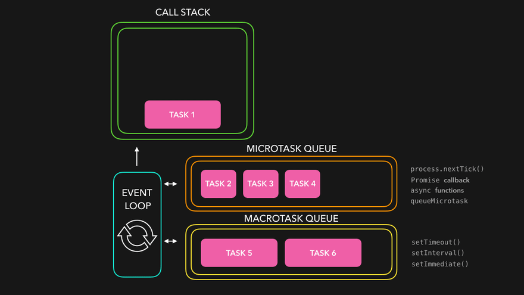

## Event Loop
Бесконечный цикл где js ожидает задачи и исполняет их. Пока есть задачи - выполняй с последеней и жди новой после выполнения. В лупе есть макрозадачи и микрозадачи



## Промисы
### Что такое промисы
Промис - это механизм, позволяющий выполнить отложенную (асинхронную) функцию

### Аргументы и методы
Как создать промис, какие есть аргумент и методы, обработка ошибок, что такое finally

### async / await
Что такое, для чего нужен, как обработать ошибку async await
```ts
async function fetchUserData(userId) {
  try {
    const userResponse = await fetch(`https://api.example.com/users/${userId}`);
    if (!userResponse.ok) throw new Error('Network error');
    const user = await userResponse.json();
    console.log('User:', user);
  } catch (error) {
    console.error('Error:', error);
  }
}

```

### Задачи
### Микрозадачи и Макрозадачи
Макро это очередь пользовательских события, setTimeout. Микро - промисы и queueMicrotask. 

```javascript
setTimeout(function timeout() {
    console.log('1');
}, 0);

let b = new Promise(function(resolve, reject) {
    console.log('2');
    resolve();
});


b.then(function(){
	console.log('3')
    queueMicrotask(() => console.log('4'))
});


console.log('5');
```

```
2
5
3
4
1
```

```javascript
function logIncrement(increment) {
  let value = 0;
  
  function increaseValue() {
    value += increment;
  
    console.log("Value: ", value);
  }

  const message = `Value are equal to ${value}`;
  
  function log() {
    console.log(message);
  }

  return [increaseValue, log];
}

const [incrementFn, logFn] = logIncrement(1);

incrementFn();
incrementFn();
incrementFn();

logFn();
```

```
Value:1

Value:2

Value:3

Value are equal to 0
```

```javascript
Promise.reject('a')
    .then(p=>p+'1',p=>p+'2')
    .catch(p=>p+'b') //
    .catch(p=>p+'с')
    .then(p=>p+'d1')
    .then('d2')
    .then(p=>p+'d3')
    .finally(p=>p+'e')
    .then(p=>console.log(p))
    
```

```
// a2d1d3
```


## Замыкания
работа с контекстом (переменными, функциями, объектами и т.д.) внутри своего лексического окружения
```javascript
function outerFunction(x) {
  let message = "Привет";
  function innerFunction(y) {
    return message + " " + x + " " + y;
  }
  return innerFunction;
}

let myClosure = outerFunction(5);
console.log(myClosure(10));
```

// 'Привет 5 10'
## Контекст
```javascript
const b = {
	a: 1,
	foo() {
		console.log(this.a + '1')
	}
}
const foo = b.foo;
console.log(foo());
```

// 1

Стрелочные функции, function declaration, function expression, в чем разница, как создать
- В обычной функции есть arguments и this, в стрелочной - нет
- стрелочная функция не может быть вызвана с new Fun()


https://leetcode.com/problems/timeout-cancellation/